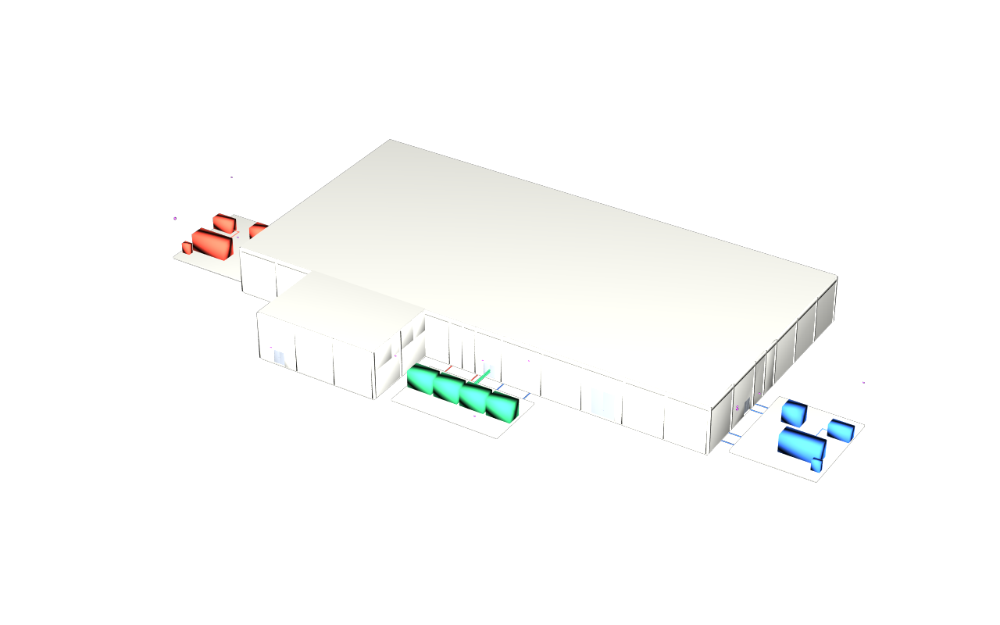

# usdaeco-datacentre — generated demo facility and portable USD variants

## Use case

The synthetic facility `demo-datacentre-01` gives the family one shared data
set for cameras, programme, repeated floors, clash and reader requirements.
YAML resolves to one build plan consumed by the IFC4X3 generator and the
existing phased C# Revit scripts. Published USD lets examples open the same
versioned facility without running an IFC converter; see [the use case](docs/usecase.md).

## The schema on an index card

This is a **data** repository and introduces no schemas.

| Data | USD representation / contract |
|---|---|
| Facility and containment | Core site, facility, levels and spaces; namespace containment |
| Built elements | Xform + AecoElementAPI; one `aeco:id`; classification codes |
| Types, systems and connectivity | Inherited catalog classes, core collections and ports |
| Converted representation | Derived Mesh bodies and space extent guides in a separate binary layer |
| Portable root | Metres, Z up, default prim, complete stock fallback prim types |
| Generator options | Separate `dist/<variant>/` roots; programmes remain XER/MSPDI inputs |

## The example

| Variant | Storeys | Rooms / voids / yards | Walls | Doors | Cameras | Added fixture |
|---|---:|---|---:|---:|---:|---|
| `base` | 2 | 30 / 0 / 3 | 92 | 41 | 45 | Existing facility |
| `floors` | 3 | 36 / 0 / 3 | 111 | 47 | 47 | Six repeated L02 rooms; one moved partition, one extra door |
| `pod` | 2 | 30 / 2 / 3 | 92 | 41 | 45 | Two ceilings, two pod products; 6 / 10 / 3 first / second / third-fix products |
| `clash` | 2 | 30 / 2 / 3 | 92 | 41 | 45 | Pod plus three pipes: hard, 5 mm clearance, tangent |
| `iris` | 2 | 30 / 0 / 3 | 92 | 41 | 45 | Ten readers at 1.2 m centre; one at 1.65 m |

All variants retain 80 columns and 11 iris readers. Full manifests include MEP
elements by concrete IFC class and activities per programme. Programme A and B
have ten activities each. Requirement values are **illustrative unless a cited
document is in the family's design record**; these three files contain synthetic
clauses, not verified regulatory content.




`spec/*.yaml` + `spec/variants/pod.yaml` → `dcbuild publish --variant pod` →
[three USD layers and a measured manifest](dist/pod/dc.manifest.json).
Open `usdview dist/pod/dc.usda`; no family plugins are required. Keep the root
and its two binary sublayers together. See [published data](dist/README.md)
and [variant contracts](docs/variants.md).

## Build and check

Use Python 3.13 with the dependencies in `pyproject.toml`: ifcopenshell 0.8.5,
USD 26.8, numpy, pydantic 2, pyyaml, Pillow and pytest. Set `PY` to that
prepared Python executable. Source commands and tests need no installed
package, editable install, setuptools or network service.

The publisher and gate read released sibling checkouts without modifying
them. The example setup below uses `usdaeco-ifc-0.1.0`, `usdaeco-core-0.8`,
`usdaeco-toolchain` v0.3.9 and `usdaeco-revit` v0.1.2 beside this checkout; validation
also uses `usdaeco-core` v0.9.2.
Sync must be v0.5.2; use frozen tag checkouts when sibling main advances.
Each checkout must match its exact pin. A source archive made with
`git archive <tag>` is also supported; unpack it into an ignored `out/dependencies/`
directory and point the corresponding override there.
The gate additionally requires a Git checkout for the toolchain archive check.
Runtime hashes use tracked files only, excluding build metadata; a fresh
`git archive v0.3.9` must reproduce the recorded toolchain hash `76b75132…`.
Explicit overrides are available:

```sh
export AECO_IFC_ROOT="../usdaeco-ifc-0.1.0"
export AECO_CORE_ROOT="../usdaeco-core-0.8"
export AECO_TOOLCHAIN_ROOT="../usdaeco-toolchain"
export AECO_REVIT_ROOT="../usdaeco-revit"
export AECO_SYNC_ROOT="../usdaeco-sync"
export AECO_VALIDATION_CORE_ROOT="../usdaeco-core"
env -u PYTHONPATH "$PY" -m dcbuild publish --variant pod
env -u PYTHONPATH "$PY" -m dcbuild publish --all
env -u PYTHONPATH "$PY" run.py --all --publish
env -u PYTHONPATH PYTHONPATH="$AECO_VALIDATION_CORE_ROOT:$PWD" "$PY" check.py --report out/check.json
env -u PYTHONPATH "$PY" -m pytest -q
```

`dependencies.json` pins converter 0.1.0, core 0.8.4 and toolchain 0.3.9 by
release and commit, with fingerprints of their runtime files. The builder uses
Revit integration v0.1.2 through its shared status-first client and verified
uploads. Publishing
verifies the pins, builds each combined IFC, invokes the converter in a
subprocess with the frozen core plugin, and checks the output in a second
process without plugins. `--out out/published` redirects the publication
parent. Scratch data lives in ignored `out/`. The cap is 10,000,000 bytes per
variant including the manifest, overview and vanilla render. Data provenance
is 0.4.5 for `floors`, 0.4.4 for `clash`, and 0.4.2 for the other variants.
The clash publisher uses a local per-product tessellation adapter before the
pinned converter's USD authoring pass; see [the measured cases](docs/variants.md#clash).

The gate keeps the previous plan, G0, IFC, G1, camera, programme, historical
byte-baseline and Revit dry-run checks. It adds the shared S01–S28 data rules,
two independent publishes per variant compared byte-for-byte against `dist/`,
plugin-free census/fallback checks, size caps and render receipts. One
`check_example()` row per variant binds its vanilla image to source/code/pin
hashes, regenerates the camera and flattened stage, and invokes the shared S28
renderer in an isolated process. Core v0.9.2 validators must import and all
eight callbacks must load through `UsdValidation`; every variant is validated.
The legacy v0.8.4 core is used only by the frozen converter subprocess. IFC header
timestamps and the generator version alone are normalized in the historical
IFC comparison; published USD uses no normalization. The final line follows
`N checks, M failed`; timings are informational.

The shared publication sweep scans tracked files and non-ignored candidates,
including `dist/` and the plain [history records](docs/history/README.md).
It rejects archives by extension or signature, including archives tracked
inside ignored directories. Untracked scratch dependencies stay in `out/`.

Other generator commands remain available:

```sh
env -u PYTHONPATH "$PY" -m dcbuild plan --variant pod
env -u PYTHONPATH "$PY" -m dcbuild check --variant pod
env -u PYTHONPATH "$PY" -m dcbuild build-ifc --variant pod
env -u PYTHONPATH "$PY" -m dcbuild validate-ifc --variant pod
env -u PYTHONPATH "$PY" -m dcbuild build-programme --variant pod
```

Outputs are `out/pod/build_plan.json`, `out/pod/targets.json`, combined and
federated files in `out/pod/ifc/`, and `{A,B}.{xer,xml,scope.json,workspace.json}`
in `out/pod/programme/`. `plan`, `check`, `build-ifc` and `validate-ifc` accept
`--variant` (default `base`). `--out` / `--dir` override their locations;
`--manifest-dir` redirects plan/IFC manifest writing for scratch builds.
Full plan and IFC builds write `manifests/demo-datacentre-01.<variant>.json`;
MEP counts are measured by concrete IFC class. Named overlays deep-merge
mappings and merge lists by `id` in base order; new ids append, scalar lists
replace. `extends` selects a parent; missing parents, cycles and duplicate
record ids fail. G0 checks design invariants, G1 checks schema/connectivity
and plan census, and G2 compares a separately supplied Revit export.

`build.sh` publishes variants; `scripts/check_all.sh` runs the gate (set
`PYTHON` or `PY`). Vanilla render regeneration uses `run.py --all --publish` and requires
`usdrecord` on PATH. Without `--publish`, outputs remain under ignored
`out/vanilla/<variant>/`. It invokes the toolchain S28 renderer with
`--disableGpu --renderer Embree --purposes proxy,render`, after flattening the
publication in a plugin-free process. A separate camera layer fits facility
bounds with a 15% margin; image receipts and cameras live in `manifests/`.
The temporary flattened crates are regenerable and stay out of git. The older
`dcbuild render --all` command refreshes the retained guide-enabled overviews.

The flake exposes `dcbuild` as its default package/application:

```sh
nix run . -- publish --variant pod
nix flake check --no-write-lock-file
```

All flake inputs use public tagged forms. For local mirrors or offline source
checkouts, use `--override-input toolchain path:../usdaeco-toolchain`,
`--override-input core path:../usdaeco-core-0.8`,
`--override-input ifc path:../usdaeco-ifc-0.1.0`,
`--override-input revit path:../usdaeco-revit`,
`--override-input sync path:../usdaeco-sync`, and
`--override-input validation_core path:../usdaeco-core`; the toolchain documents the mapping
of its own nested inputs in
[repository conventions](https://github.com/criad-com/usdaeco-toolchain/blob/v0.3.9/docs/repo-conventions.md).
Packaging is not proven until the single recorded Nix attempt resolves its
inputs; source execution is checked independently.

## Family

The repository has `kind: data`, `tier: data` and no schemas. Its builder
requires `usdaeco-revit >=0.1,<0.2`, tested at v0.1.2.
The exact generation/check inputs are converter **v0.1.0**, core **v0.8.4**
and toolchain **v0.3.9**. The `usdAecoValidators` pin selects core **v0.9.2**
for the gate. Generation core stays at 0.8.4 to match the converter; published
stages remain readable without it. CCTV **v0.4.8** supplies the current native
importer census. Sync **v0.4.5** remains a historical observation; the optional
Revit integration uses Sync **v0.5.2** (also required for offline imports). These are recorded in
[dependencies.json](dependencies.json) and the native receipt, alongside the
active publisher dependencies.
The [family board](https://github.com/criad-com/usdaeco-board) consumes the
manifests, counts, acceptance receipts and overview images.

## Layout

| Path | Contents |
|---|---|
| `spec/` | Facility inputs, variant overlays, programmes and illustrative requirements |
| `src/dcbuild/` | Resolver, IFC builder, publisher, QA and source CLI |
| `tests/` | Source-based tests; no installed package needed |
| `dist/<variant>/` | Three USD layers, receipt, overview and vanilla PNGs |
| `manifests/` | Generator counts, baseline hashes, cameras and render receipts |
| `docs/` | Use case, variant contracts, acceptance and the [history directory](docs/history/README.md) |
| `revit/` | Hashed native model script pack, shared-client builder and live launcher |
| `out/` | Ignored scratch plans, IFCs, comparisons and gate reports |

## Status

Version **0.4.8** exposes all 26 historical receipt and patch files directly
under `docs/history/`, with their original member paths and bytes preserved.
The family term sweep finds **0** prohibited terms; nothing was redacted or
dropped. The gate and regression tests reject tracked archives. All five
published variants retain their bytes.

The toolchain advances to **v0.3.9**, which derives its Nix package version
from library metadata. Public names remain `github.com/criad-com`; all other
dependency pins retain their preceding values.
Five vanilla receipts record the new toolchain; all published stages, manifests,
cameras and images retain their bytes. Generation and historical evidence
inputs remain declared under `fixtures`.
Version **0.4.5** makes L02 typical of L01 except for the moved and resized
partition and the extra door. The manifest records wall `wall.l2.v.016`, its
1 m eastward offset and 3.2 m extension, and door `door.office.2b` in that wall.
The published comparison finds exactly two differences; partition lengths are
**43.0 m / 46.2 m (+3.2 m)**. The released typical consumer agrees.
The gate passes **204 checks, 0 failed** (162 passes, 38 informational timings,
four native variants NOT RUN), with **213 tests** and **29/0 structure rules**.
See [release acceptance](docs/acceptance-0.4.8.md),
[publication acceptance](docs/acceptance-0.4.5.md) and [the floor geometry contract](docs/variants.md#floors).
The native builder uses
`usdaeco_revit.transport.Client`.
The base update created **0** cameras and updated **45**; IFC4X3 export succeeded.
See [Revit 0.4.2 acceptance](docs/acceptance-revit-0.4.2.md) for measured
export/parity/importer results and the offline gate totals.

All five published variants remain available, with three layers per variant.
The four other variant directories, source manifests and cameras retain their
v0.4.4 bytes (32 files). Their rendering receipts change only to correct the
old toolchain runtime digest; image bytes remain identical. The gate includes
that comparison and a fresh archive reproduction of the toolchain pin.
Native floors/pod/clash/iris remain **NOT RUN** and require further family work.
Nix packaging remains **not proven**; the current acceptance records its one
offline attempt. Requirement values remain illustrative.

For an authorized native rerun, set the endpoint, remote work directory and
camera family directory as described in the [builder guide](revit/README.md):

```sh
env -u PYTHONPATH "$PY" -m dcbuild plan
env -u PYTHONPATH "$PY" revit/driver.py --update --dry-run
env -u PYTHONPATH "$PY" revit/driver.py --update
```

`--update` requires the existing base model, runs nine camera batches, and
exports IFC4X3. The offline gate checks the current source and committed native
measurements; it never contacts Revit. Explicit NOT RUN rows are counted
separately from correctness passes and informational timings.

### Earlier acceptance and design evidence

All elapsed times print as `INFO` measurements and never fail the correctness
gate. Command exit codes and semantic checks remain blocking. In the JSON
report, timing rows have `status: "INFO"`, `ok: null` and numeric `seconds`;
`total = passed + failed + informational + not_run`. The summary's check count includes
the informational rows, which are counted separately from passes.
The [0.2.2 offline run](docs/acceptance-offline.md) measured a full IFC build
(combined plus seven federated files) at **14.297 s**, and an independent
second build at **14.318 s**. These are observations on a shared machine,
not build-time promises. The combined generator-suite and scenario timing
belongs to `usdaeco-scenarios`; this repository makes no scenario time-budget claim.

The Revit builder authors cameras as native Security Devices on storey levels,
adds 30 interior rooms, and preserves deterministic IFC_GUID separately from
Mark. Export uses IFC4x3, common/internal properties and base quantities.
Camera batches update existing instances by Mark. See the
[measured Revit acceptance](docs/acceptance-revit.md) for export/parity results
and the documented tier C reader limitations.

The historical **0.3.4** release passed **59 checks, 0 failed** (51 correctness passes and
8 informational timings), with **75 pytest tests**. Tested interoperability
inputs are **core v0.8.4, CCTV v0.4.8 and Sync v0.4.5**, with exact release
revisions in [dependencies.json](dependencies.json). See the
[offline refresh and output comparison](docs/acceptance-0.3.4.md) for reproduction,
raw hashes and timestamp exceptions. Native Revit was **NOT RUN** for this refresh.
The 0.3.2
design closes exterior coverage by sharing the wide opening's existing bullet with its neighbouring approach. The family schedule now
passes **11/11 critical doors, 5/5 exterior doors, 7/7 corridors, 8/8 yards
by day and night, and 3/3 lobby targets**, with zero privacy hits and zero
hall placement errors. All **45 camera GUIDs** remain stable; one camera
moves and gains a second target association.

Two supplementary spine views still name columns as blockers. Both affected
corridors have **288/288 samples covered** by fixed cameras; no critical door
is involved. This is an explicit non-critical exception, not a claim of zero
column blockers. The 0.3.2 combined family acceptance records **59 checks,
0 failed**: 56 PASS, this column FINDING, and two offline Revit NOT RUN rows.
The completed full run and the final metadata/layout repairs are recorded in
[exterior acceptance](docs/acceptance-exterior.md).

The **0.3.3 native rerun** applies that exterior move: both camera phases
created **0** and updated **45**, preserving all camera identities, all 30 rooms
and the foreground model. The moved bullet is within **1 mm** of its new pose.
The fresh IFC4x3 export passes **527/527** required product joins, including
**45/45** camera positions and pan/tilt/focal values. Stable CCTV imports
**45 cameras / 45 sensors**; 48 unmatched helper subinstances remain explicit.

The unmodified **Sync 0.4.3** runner passes **12/12** live cases with
**10/10** native rollbacks and two zero-request refusals. It derives its expected
45-camera census from the seed and converges **45/45** cameras within
0.001 rad / 0.001 m. See [native acceptance](docs/acceptance-revit.md) for
measured errors, elapsed time and deviations, and the [Revit guide](revit/README.md#repeating-the-45-camera-design)
for reproduction. Ordinary checks remain offline. The preceding
[0.3.1 native run](docs/acceptance-revit-0.3.1.md) remains historical evidence.

### Camera design rules

The three optical types and every placement rule are in [security.yaml](spec/security.yaml).
The resolver derives positions from doors, room rectangles and yard pads; both
builders consume the same plan. There are **45 cameras / 45 heads / 3 types**,
at the declared 45-camera recorder allowance (90-day retention in the study).

| Group | Count | Rule and reason |
|---|---:|---|
| Critical doors | 11 fixed domes | 3.0 m pendant height; 0.65 m setback; 0.45 m lateral offset; aim at the door; 60° down; 3 mm. Clears the tray crossings while keeping the entire approach face within 3 m. |
| External doors | 5 fixed bullets | Default: 3.5 m high, 1.7 m setback, 55° down, 3.7 mm, IR 40 m. Four retain this placement; the wide opening uses the shared rule below. |
| Shared exterior approaches | Included above: 1 bullet | For an opening ≥3 m wide, find the nearest smaller exterior door within 18 m, on the same level and facade with the same approach normal. Centre the pole between that neighbour's threshold and the wide opening's far jamb; set back 18.25 m, mount at 8 m, use 7.5 mm and aim at 1.2 m. Retain the wide opening's camera identity and add the neighbour as a supplementary target. |
| Corridors | 18 fixed domes | Opposing pairs at segment ends; adjacent cameras ≤18 m apart; six on the 72 m spine, two in each other corridor. 3.5 m mount, 4 mm, 15° down, 24 m usable range. |
| Compact corridor | Included above | Aspect ratio ≤1.5 uses 3 mm and 60° down across the short space, avoiding the central office tray. |
| Low ceilings | Included above | Height capped at clear height −0.1 m; the upper office corridor therefore uses 2.9 m above its floor. |
| Yard fixed views | 6 bullets | Two opposing corners per pad, mirrored across the building centre; 6.5 m poles, 35° down, 3.7 mm, IR and range 40 m. Height separates them from the existing 6 m PTZ housings. |
| Lobby fixed views | 2 domes | Opposing corners inset 0.3 m; 3.3 m high, 4 mm, 25° down, range 14 m. All lobby area and entrance samples pass. |
| Supplementary PTZ | 3 | Existing two yard cameras and lobby camera, seven presets and three tours, unchanged. Fixed views supply critical coverage. |

For plane density, `rho = H / (2 d tan(hfov/2))`. The 3 mm dome has
2,592 horizontal pixels and 104° HFOV. An independent corner check includes
both edges and the full 0.3–2.1 m face: maximum lens-to-face distance
**2.945658 m**, minimum **343.741953 px/m**. Occlusion is then checked by the
family runner. Readers retain their identities and sit beyond the wall face
on the recorded approach side.

To run only the study schedule, set `AECO_FAMILY_ROOT` to the directory holding
the family siblings. The checkouts must have built plugins matching their
manifests. Assemble one aggregate in this checkout; this reads sibling resources
without building or modifying those checkouts:

```sh
env -u PYTHONPATH -u PXR_PLUGINPATH_NAME "$PY" "$AECO_FAMILY_ROOT/usdaeco-toolchain/tools/pluginset.py" out/pluginset \
  "$AECO_FAMILY_ROOT/usdaeco-core-0.8/plugins/usdAeco/resources" \
  "$AECO_FAMILY_ROOT/usdaeco-buildup/plugins/usdAecoBuildUp/resources" \
  "$AECO_FAMILY_ROOT/usdaeco-wall/plugins/usdAecoWall/resources" \
  "$AECO_FAMILY_ROOT/usdaeco-pipe/plugins/usdAecoPipe/resources" \
  "$AECO_FAMILY_ROOT/usdaeco-cctv/plugins/usdAecoCctv/resources" \
  "$AECO_FAMILY_ROOT/usdaeco-sync/plugins/usdAecoSync/resources"
export AECO_SCENARIOS_SOURCE="$AECO_FAMILY_ROOT/usdaeco-scenarios"
export AECO_PLUGINSET="$PWD/out/pluginset"
export AECO_DATACENTRE_SOURCE="$PWD"
env -u PYTHONPATH "$PY" scripts/study.py --scenarios "$AECO_SCENARIOS_SOURCE" --pluginset "$AECO_PLUGINSET" --output out/study
env -u PYTHONPATH "$PY" scripts/sample_obstructions.py out/study
env -u PYTHONPATH "$PY" scripts/column_views.py out/study --scenarios "$AECO_SCENARIOS_SOURCE" --pluginset "$AECO_PLUGINSET" --output out/column-views
```

The study command exits nonzero for unresolved coverage findings.
It calls the family's original schedule and coverage functions, records source
revisions and the schedule file hash, and keeps every requirement and sample.
The obstruction diagnostic tests the actual closed convex IFC bodies. It does
not remove points or declare inaccessible plant interiors to be covered.

### Status coverage on the Revit route

The recorded Revit export carries occurrence `Pset_*Common.Status = NEW`
as follows ([numeric evidence](docs/history/acceptance-through-0.4.0/artifacts/revit-export-acceptance.json)):

| Product category | Common.Status NEW | Export limitation / core result |
|---|---:|---|
| Physical elements | **1,514/1,514 (100%)** | All 1,514 element phases authored by core |
| Spaces | **None (0/30)** | Status remains in internal Identity Data; exporter SpaceCommon has no Status entry; core space phases remain unauthored |
| Ports | **None (0/2,048)** | Exporter omits Common.Status |
| Openings | **None (0/40)** | Exporter omits Common.Status |
| Grids | **None (0/2)** | No applicable Common template |
| Other spatial products (site, building, levels) | **None (0/5)** | Exporter omits Common.Status; levels retain internal Identity Data Status |

Raw coverage is **1,514/3,639 IfcProducts (41.605%)**. Native rooms have
Status NEW on **30/30**; that input coverage does not imply Common.Status
export coverage. These are the recorded exporter limits on the Revit route.

### Camera range and density defaults

The defaults in [security.yaml](spec/security.yaml) apply to both builders:

| Camera type | Range | Target density |
|---|---:|---:|
| Dome (`dome_5mp`) | 12 m | 250 px/m |
| Outdoor bullet (`bullet_4mp_outdoor`) | 40 m | 250 px/m |
| PTZ (`ptz_4k`) | 20 m | 250 px/m |

A zero target density leaves the native Revit family's optical formulas stale.
The positive per-type default lets the guides regenerate; the native builder
verifies the resulting clipped radii before committing each camera batch.
An explicit occurrence density of zero is preserved in the IFC contract,
while the native payload uses the positive type fallback.

### Generated IFC route

Every identity is the compressed IFC form of
`uuid5(NAMESPACE_DNS, "usdaeco-datacentre:" + id)`; stable spec ids such as
`pwr.msb.a` are carried in `DC_Identity.Id`. The namespace belongs to this demo.

See [facility brief](docs/brief.md) and [authoring conventions](docs/conventions.md).

The resolver currently produces **45 cameras / 45 heads / 3 types**, 41 doors,
12 alarms, 11 readers, 30 interior spaces and 3 exterior yard spaces. Camera
placement and presets come from `spec/security.yaml` and the resolver.
`out/base/targets.json` carries door approaches, region polygons and camera poses.

Design deviation: four blocked doors move 3 m along their walls. The 4 m
centre-corridor wall has columns at both ends and the midpoint; its door is
changed to a 0.9 m single opening at x=35 m (1 m shift), giving 0.35 m clearance.

IFC cameras use the **usdaeco-cctv-ifc/1.0** contract: complete type/occurrence
JSON in tier A plus correctly typed/unit-converted standard camera properties
and preset tables in tier B. Every camera reuses its type's small mapped body,
belongs to `sys.sec`, and has an unrotated device frame with separate aim drivers.

The recorded 0.2.2 IFC baseline has Status NEW on **9,228/9,228 eligible products (100%)** in the combined IFC,
including spatial products and ports. The one IfcGrid has no applicable Common
Pset in the template library and is explicitly counted: raw coverage is
9,228/9,229 products (99.989%). No element needing a Common Status is skipped.

The historical 0.1.0 family probe (core v0.8.0, CCTV v0.3.0) converted 2,938 elements,
33 spaces, 6,212 ports and 9 systems, with 0 unparented elements. It authored
2,938 element phases (100%) and 33 space extents. The two utility
intakes retain their explicit proxy mapping. Import found **29 cameras / 29
sensors / 3 types / 7 presets / 0 unmatched**. This importer reads tier B only:
all 29 sensors lack full decoded optics and derivation skips them. Full optical
round-trip acceptance requires the newer tier A importer. The stage composes
with no family plugins and no composition errors.

See [acceptance evidence and deviations](docs/acceptance.md). The ordinary gate
needs no external services or source model. The column exception is recorded separately; Nix packaging is tracked in the current acceptance record.
The native model/export results are recorded independently of the offline gate.


### Status coverage by export route

| Route / population | Common.Status NEW | Core authored phase |
|---|---:|---:|
| Generated IFC eligible products | 9,244/9,244 | Elements 2,954/2,954; spaces 33/33 |
| Generated IFC raw products (one grid has no template) | 9,244/9,245 | — |
| Revit physical elements | 1,514/1,514 | 1,514/1,514 |
| Revit raw IfcProducts | 1,514/3,639 | — |
| Revit spaces (internal Status 30/30) | 0/30 | 0/30 |
| Revit levels (internal Status 3/3) | 0/3 | 0/3 |
| Revit ports / openings | 0/2,048 · 0/40 | — |

The [export artifact](docs/history/acceptance-through-0.4.0/artifacts/revit-export-acceptance.json) is recorded native
evidence, **not enforced** by the offline generator gate. No post-export
property repair or inferred phase is used. `dependencies.json` pins the
interoperability releases; `pyproject.toml` also declares the shared Revit client.
See [packaging acceptance](docs/packaging.md) for the packaging baseline and limitations.

## Licence

[MIT](LICENSE).

Runtime dependencies retain their own licences; third-party code is not vendored.

| Dependency | Licence | Use |
|---|---|---|
| OpenUSD | Apache-2.0-style TOST | USD runtime and rendering |
| numpy | BSD-3-Clause | Numeric arrays |
| PyYAML, pydantic | MIT | Facility inputs and validation |
| Pillow | HPND | Image inspection |
| IfcOpenShell | LGPL-3.0 | Imported only |
| OCCT | LGPL-2.1 | Dynamically linked by IfcOpenShell only |
| pytest | MIT | Tests and IFC EXPRESS rule validation |
| usdaeco-revit | MIT | Optional native integration client |
