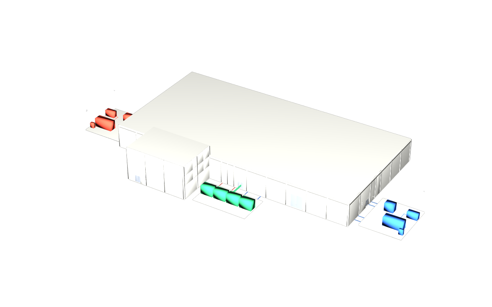

# Published demo data centre stages

Six design options for `demo-datacentre-01` compose with stock USD. Keep each
variant directory together; no sibling checkout, family plugin or converter
is needed to view its `dc.usda` entry. From the repository root:

```sh
env -u PYTHONPATH -u PXR_PLUGINPATH_NAME -u PXR_AR_DEFAULT_SEARCH_PATH usdview dist/full/dc.usda
```

Replace `full` with `base`, `floors`, `pod`, `clash` or `iris`. Every root
declares its default prim, metres, Z up and eight stock fallback prim types.
Space extents use `purpose = guide`; leave guides off for the building view.
Separate camera layers in `manifests/cameras/` frame the publication views.



`base` is the original facility; `floors` adds a repeated office floor and two
deliberate changes; `pod` adds fitout and planning fixtures; `clash` adds three
coordination cases; `iris` varies reader heights. `full` combines all fixtures.
Exterior renders show the building; inspect internal differences in usdview.
See [variant contracts](../docs/variants.md) for the geometry and merge rules.

Counts come from each `dc.manifest.json`. Spaces include rooms, voids and
yards; meshes include extent guides. The two unclassified/proxy entries are
explicitly classified IFC proxies for utility intakes.

| Variant | Levels | Spaces | Elements | Ports | Meshes | Unparented | Proxies |
|---|---:|---:|---:|---:|---:|---:|---:|
| base | 2 | 33 | 2954 | 6212 | 2987 | 0 | 2 |
| floors | 3 | 39 | 2983 | 6212 | 3022 | 0 | 2 |
| pod | 2 | 35 | 2977 | 6238 | 3012 | 0 | 2 |
| clash | 2 | 35 | 2980 | 6244 | 3015 | 0 | 2 |
| iris | 2 | 33 | 2954 | 6212 | 2987 | 0 | 2 |
| full | 3 | 41 | 3009 | 6244 | 3050 | 0 | 2 |

The historical variants each have three USD files and a 10,000,000-byte cap.
All 30 files in their five directories retain their v0.4.9 bytes.

`full` has nine delivered IFC4X3 files and their USD twins. Delivery order is
site, arch, structure, cooling, electrical, it, fitout, security, shared.
Shared owns all spatial definitions; each discipline overlays that spine.
Architecture is delivered by Revit 2027 in 0.6.0; the other eight packages remain
generator-produced. Only `arch.ifc`, its three twin layers and `dc.manifest.json`
change inside `full/`. See [the native acceptance](../docs/acceptance-revit-0.6.0.md).
The two reviewed images retain generator 0.5.2 pixels and their original
provenance; a fresh S28 render independently checks the current native stage.
Every `<package>.usda` sublayers its readable `.semantics.usda` before its
binary `.geometry.usdc`. Layer provenance names the producer, source IFC and
SHA-256 of the adjacent delivered IFC bytes, including its final descriptions.
All 27 source stamps across nine twins use this rule. The three architecture
layers name the native producer and v0.6.0; the other 24 retain v0.5.2.
The 0.5.1 delivery adds exact USD
target paths to all 1,008 external port document-reference descriptions:
cooling 184, electrical 344, IT 480, all other deliveries zero. The nine serves
targets remain native `IfcRelServicesBuildings` relationships (cooling 3,
electrical 2, IT 3, security 1). A single-file reader can resolve both forms.
The generator twins retain their prior opinions. The native architecture
replaces its whole delivery, retains 167 referents and adds nine catalog types
relative to the generator. Both images retain their prior bytes.
The [full manifest](full/dc.manifest.json) inventories every delivered
file except itself and records counts and every cross-package target.
Its `files` hashes bind the enriched IFCs and match the twins' source stamps
directly; the redundant `twinSourceFiles` field is removed. The publisher
resolves reference paths, enriches IFC descriptions, then converts and stamps
the final delivered bytes. The gate checks unchanged generator IFC/twin and
image bytes, and binds the four native architecture files to their own baseline.

The full directory is capped at **40,000,000 bytes**. Its measured publication
is **22,940,413 bytes**, including all delivered IFCs, twin layers, roots,
manifest and retained images.
Both images are 1280×800, non-uniform, and below 400,000 bytes each.

`full/dc.connected.usda` is the connected entry and needs the **usdIfc plugin
from usdaeco-ifc ≥ 0.3**. It references discipline IFCs with `spine=over`, then
shared IFC. Connected composition is **not proven** here. The reader also
needs to translate the delivered external-port document references; see the
[federation contract](../docs/variants.md#federation-contract).

To reproduce, prepare the pinned sources and Python environment in the
[root README](../README.md#build-and-check), and put `usdrecord` and
`usdchecker` on PATH:

```sh
env -u PYTHONPATH "$PY" -m dcbuild publish --variant full
env -u PYTHONPATH "$PY" check.py --report out/check.json
```

Republishing the unchanged facility preserves its images and reproduces the
committed full inventory and vanilla receipt inputs. Use
`run.py --variant full --publish` to regenerate both full images when rendered
content changes. Ordinary runs
write ignored `out/vanilla/<variant>/`. The full publisher normalizes IFC
headers, then invokes the hash-verified frozen converter/core inputs. The
five historical publication paths and data provenance stay unchanged.

S28 flattens each composed publication in a plugin-free process, relocates
the crate and camera to an empty directory, then runs stock
`usdrecord --disableGpu --renderer Embree --purposes proxy,render`. A fresh
render must be non-uniform and fit all facility bounds with a 15% margin.
Historical reviewed pixels remain fixed; PNG hashes are not compared between
Embree runs. Source/code/pin hashes, normalized stage hashes, camera hashes
and image inventories are recorded in the [vanilla receipts](../manifests/vanilla.json).

The gate compares two fresh publications byte-for-byte with committed data,
checks full against an independent monolithic conversion, mutes each delivery,
and runs all eight core validators. The publication sweep inspects IFC text
and rejects archives even when they use another extension. Combined IFCs,
plans, temporary flattened crates and fresh gate outputs stay in ignored
`out/`; only the delivered federation is committed.
