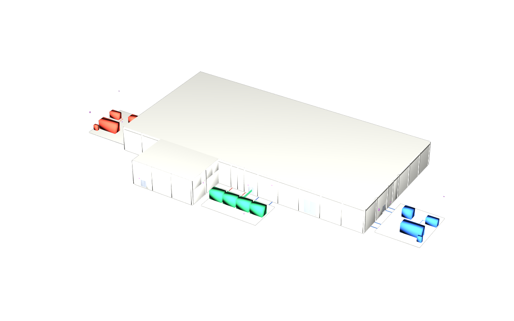

# Published demo data centre stages

Five standalone design options for `demo-datacentre-01` compose with stock USD.
Keep each variant's three USD files together; no sibling checkout, family
plugin or IFC converter is needed to view them. From the repository root:

```sh
env -u PYTHONPATH -u PXR_PLUGINPATH_NAME -u PXR_AR_DEFAULT_SEARCH_PATH usdview dist/base/dc.usda
```

Replace `base` with `floors`, `pod`, `clash` or `iris`. The root declares its
default prim, metres, Z up and stock fallback prim types. Its two relative
sublayers carry semantics and derived tessellated geometry. Space extents use
`purpose = guide`; leave guides off for the building view. The separate camera
layers in `manifests/cameras/` record the framed publication views.



`base` is the original facility; `floors` adds a repeated office floor and two
deliberate changes; `pod` adds fit-out and planning fixtures; `clash` adds three
coordination cases; `iris` varies reader mounting heights. Exterior renders
show the building; internal differences require a closer view in usdview.
See [variant contracts](../docs/variants.md) for those fixtures.

Counts below come directly from each `dc.manifest.json`. Spaces
include rooms, voids and yards; meshes include extent guides. The two
`unclassified` entries are explicitly classified IFC proxies for utility
intakes.

| Variant | Levels | Spaces | Elements | Ports | Meshes | Unparented | Unclassified/proxy |
|---|---:|---:|---:|---:|---:|---:|---:|
| `base` | 2 | 33 | 2954 | 6212 | 2987 | 0 | 2 |
| `floors` | 3 | 39 | 2983 | 6212 | 3022 | 0 | 2 |
| `pod` | 2 | 35 | 2977 | 6238 | 3012 | 0 | 2 |
| `clash` | 2 | 35 | 2980 | 6244 | 3015 | 0 | 2 |
| `iris` | 2 | 33 | 2954 | 6212 | 2987 | 0 | 2 |

All file sizes are bytes. Each variant remains below the 10,000,000-byte cap.

| Variant | dc.usda | Semantics USDC | Geometry USDC | Manifest | Overview PNG | Vanilla PNG | Total |
|---|---:|---:|---:|---:|---:|---:|---:|
| `base` | 517 | 1,471,556 | 332,637 | 990 | 144,133 | 144,319 | 2,094,152 |
| `floors` | 517 | 1,479,303 | 338,756 | 992 | 145,848 | 145,912 | 2,111,328 |
| `pod` | 517 | 1,483,117 | 344,521 | 989 | 144,082 | 144,340 | 2,117,566 |
| `clash` | 517 | 1,485,167 | 359,760 | 6,161 | 144,199 | 144,689 | 2,140,493 |
| `iris` | 517 | 1,471,930 | 332,637 | 990 | 144,529 | 144,242 | 2,094,845 |

Each `vanilla.png` is 1280×800, non-uniform and below 400,000 bytes. It comes
from the toolchain v0.3.2 S28 path: `usdrecord --disableGpu --renderer Embree
--purposes proxy,render`, running in a fresh process without family plugins or
`PYTHONPATH`. Before rendering, the composed publication is flattened in a
plugin-free process, then the crate and camera are relocated into an empty
directory. All facility bounds fit the camera frustum with a 15% margin.
Source/code/pin hashes, normalized flattened-stage hashes, camera hashes and
image inventories are recorded in [vanilla receipts](../manifests/vanilla.json).
The guide-enabled `overview.png` is also refreshed for `clash` only.

To reproduce, prepare the pinned sources and Python environment described in
the [root README](../README.md#build-and-check), and put `usdrecord` on PATH:

```sh
env -u PYTHONPATH "$PY" -m dcbuild publish --all
env -u PYTHONPATH "$PY" run.py --all --publish
```

Use `run.py --variant pod --publish` for one image, or omit `--publish` to
write only ignored `out/vanilla/<variant>/` outputs. The publisher regenerates
combined IFCs and converts them using the frozen converter/core inputs. The
package is v0.4.4; only `clash` data provenance advances to v0.4.4. Its
manifest includes the planted geometry and measured comparison cases.
Four variant publications retain their v0.4.3 bytes. All five publications
must match two independent fresh publishes. PNG pixels are not compared across Embree runs;
source freshness, committed image hashes, non-uniform content and caps are.

Size discipline: no tracked file exceeds 2,000,000 bytes. Combined/federated
IFCs, resolved plans, temporary flattened crates and fresh verification renders
are regenerable with the commands above and stay under ignored `out/`. The
flattened crates are not duplicated in git. Measured tracked-tree totals before
and after the preceding release are in [acceptance](../docs/acceptance-0.4.3.md).
