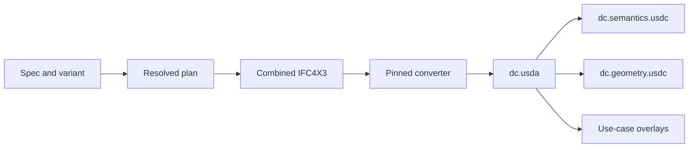
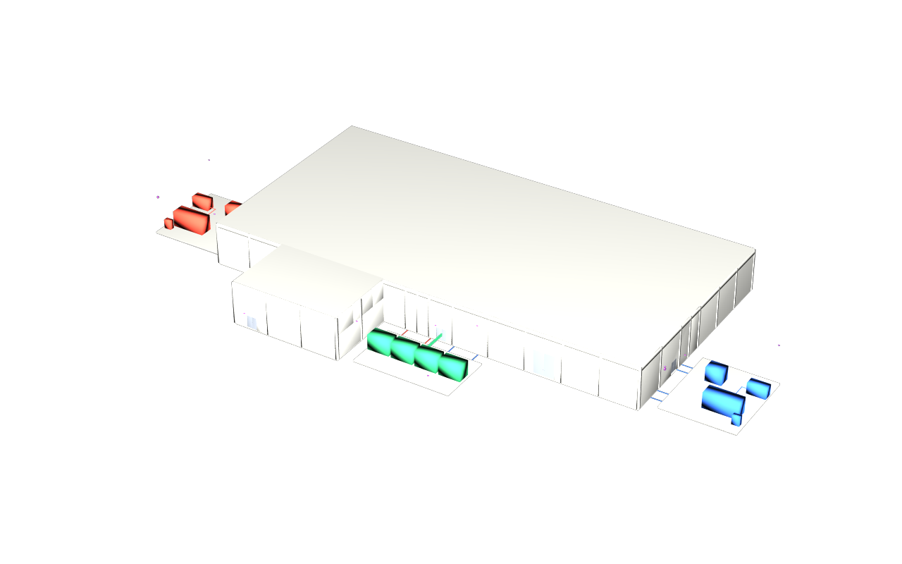

# A shared demo facility

## 1 The problem

Independent examples become hard to compare when every tool invents a
different building, identity recipe or set of defects. This synthetic data
centre supplies one versioned facility, `demo-datacentre-01`, and deliberate
design options that each consumer can reproduce and measure. It is an
illustrative coordination fixture, not a real facility or a construction brief.

## 2 The data as it arrives

YAML supplies the facility, spaces, structural grid, architectural elements,
power, cooling, IT and security. Named overlays supply repeated office rooms,
ceiling voids, fit-out products, planted pipe comparisons and reader heights.
The resolver produces a common plan; the IFC4X3 builder writes a combined
coordination file and federated discipline files with the same identities.
Programme A/B emit XER, MSPDI and scope/workspace sidecars. All requirements
and their citations are explicitly illustrative.

The original native Revit script pack consumes that plan too. Its recorded
export limitations remain in [the Revit guide](../revit/README.md); this
release adds no native authoring work.

## 3 The model in USD

This data repository defines no new schema. The pinned converter maps IFC
spatial aggregates into core site/facility/level/space prims and elements into
Xforms with `AecoElementAPI`. Kind comes from IFC classification codes, types
from inherited catalog classes, groups from core collections and connectivity
from core ports. Ad-hoc properties stay under `aeco:props:`. One namespace
records containment; changing a location does not mint another identity.

The identity recipe is `uuid5(NAMESPACE_DNS, "usdaeco-datacentre:" + id)`.
The generator compresses that UUID into IFC `GlobalId` and carries the stable
spec key in `DC_Identity.Id`. Conversion expands the GUID into the same UUID
as `aeco:id`. Reused spec ids retain identity across variants, disciplines
and rebuilds. Temporary and final pod products have distinct authored ids;
programme B moves the existing temporary identity through its placement
sidecar.

The root declares metres, Z up, default prim and `fallbackPrimTypes` for
every used Aeco type. Its two relative sublayers separate semantics from
derived meshes. Bodies and space extents retain their provenance; extents
are guide volumes and never physical obstacles. The publisher losslessly
exports semantics from USDA to USDC and changes only that sublayer path.

## 4 Workflow

1. Read the [variant contracts](variants.md) and select a named overlay.
2. With the prepared Python and pinned sibling sources described in the
   [README](../README.md), run
   `env -u PYTHONPATH "$PY" -m dcbuild publish --variant pod` or `--all`.
3. Open `usdview dist/pod/dc.usda`. No family plugins or IFC installation are
   required to view a publication.
4. Generate programmes with `env -u PYTHONPATH "$PY" -m dcbuild build-programme --variant pod`.
5. Use `env -u PYTHONPATH "$PY" run.py --all --publish` to regenerate vanilla
   images from facility bounds. The display layer hides space extents and
   requests `guide,proxy,render` purposes.
6. Run `env -u PYTHONPATH "$PY" check.py --report out/check.json`. Consumers
   pin the release, compose the selected root beneath their input overlays,
   and write their derived outputs to separate layers.

## 5 Validation

| Rule | Severity | Detects |
|---|---|---|
| G0 design checks | Error | Invalid plan, doors, scopes, enclosure/inspection relationships and declared variant expectations |
| G1 IFC checks | Error | Schema/EXPRESS failures, census, identity, placement and connectivity drift |
| Exact source pins | Error | Different runtime source files or checkout revisions from the recorded converter/core/toolchain |
| Published byte identity | Error | Any difference between two independent publishes or committed layers/manifests |
| Plugin-free composition | Error | Missing sublayers, units/default prim, missing stock fallbacks or mismatched census |
| Publication cap | Error | Variant files exceeding 10,000,000 bytes in total |
| Render receipt | Error | Missing, uniform, oversized or stale overview image |
| Published clash cases | Error | Mesh distance, finite-face witness, measured band, stamp or source/manifest expectation disagrees |
| Shared structure and term sweep | Error | Invalid data-repo skeleton or unsanitized text, including decoded USD layers |
| Timings | Info | Measured elapsed time; no performance promise |

The existing 150-test generator baseline is retained. Additional tests
exercise published stages, tampered layers, missing fallbacks and mismatched
dependency files without requiring an installed package.

## 6 The example on the demo data centre

| Variant | Published elements / spaces / levels | What consumers take |
|---|---|---|
| base | 2,954 / 33 / 2 | Core and CCTV: identity, spatial structure, 45 cameras and their original coverage fixtures; Sync/integrations: stable joins |
| floors | 2,983 / 39 / 3 | Typical: repeated office L02, one moved/resized partition, one extra door; +3.2 m partition length |
| pod | 2,977 / 35 / 2 | Plan: voids, fit-out, temporary/final pod, programme A findings and clean programme B |
| clash | 2,980 / 35 / 2 | Clash, wall, pipe and solid: hard crossing, 5 mm clearance and analytical tangency |
| iris | 2,954 / 33 / 2 | Compliance: ten readers at 1.2 m centre, one at 1.65 m, and illustrative requirement bands |

All five have zero unparented elements. Each manifest carries the full
element/space/level/port/mesh/unparented/unclassified census and per-layer
hashes/sizes. Mesh counts include space extents. Two utility proxies remain
explicitly classified as IFC proxies and are counted as unclassified by the
converter's health metric. The board and scenarios consume these receipts,
the variants table and the rendered overviews.

## 7 Trade-offs and alternatives

Committing USD makes consumer examples independent of IFC conversion and
keeps a reviewable release fixture. Binary semantics are substantially
smaller than text, so human diffs use USD tooling while the gate detects
every byte change. Separate option roots give consumers a simple asset path;
they do not encode revision history as USD variant sets.

The source identity recipe is owned by this demo. Consumers join by `aeco:id`
and should not copy its namespace into their own unrelated facilities.
The published contract stays on core 0.8.4 because converter 0.1.0 targets
that release; this is recorded even though newer family schemas exist.

## 8 Out of scope and open questions

Native Revit changes, exact geometry, application-level schedule imports,
4D playback and downstream validation engines are separate work. Pod bodies
are bounding envelopes. The tangent fixture now proves mesh false penetration
against an analytically tangent source circle; an exact-body engine is still
downstream work. Reader requirements
are synthetic examples, not verified regulations. See the detailed
[generator deviations](acceptance-0.4.0.md#deviations).

## 9 Status

Version 0.4.8 expands the [historical records](history/README.md) into 26
plain files with original paths and bytes. The family term sweep reports
zero findings; no redactions or drops were needed. The gate and tests reject
tracked archives, and all five published variants remain byte-identical.
Toolchain v0.3.9 fixes Nix package-version metadata; the five vanilla receipts
record that pin, and every other dependency pin remains unchanged. The
[release acceptance](acceptance-0.4.8.md) records **204 checks, 0 failed**,
**213 tests**, 29 structure rules and five fresh plugin-free renders.

Version 0.4.7 updates public names to `github.com/criad-com` and pins toolchain
v0.3.8. The [release acceptance](acceptance-0.4.7.md) records 203 checks, zero
failures and 197 tests. Published data retains the [0.4.5 acceptance](acceptance-0.4.5.md)
and the [measured floor contract](variants.md#floors). The released typical
consumer confirms exactly two differences and +3.2 m.
The preceding 0.4.2 release passed 181 checks with 0 failures and 172 tests, including four
explicit native-variant NOT RUN rows. It uses the shared Revit transport and publishes
all five variants through converter 0.1.0 and core 0.8.4. See the
[publication acceptance](acceptance-0.4.1.md) and
[current Revit acceptance](acceptance-revit-0.4.2.md). Independent layer and manifest bytes agree with no normalization.
The data-kind skeleton uses the exact keys required by the shared conventions;
schema/plugin/example-directory rules do not apply to this schema-free repo.
The gate separately enforces render and vanilla rules for `dist/`, which the
generic data structure lint does not inspect. Packaging remains subject to
the single recorded Nix input-resolution attempt.
